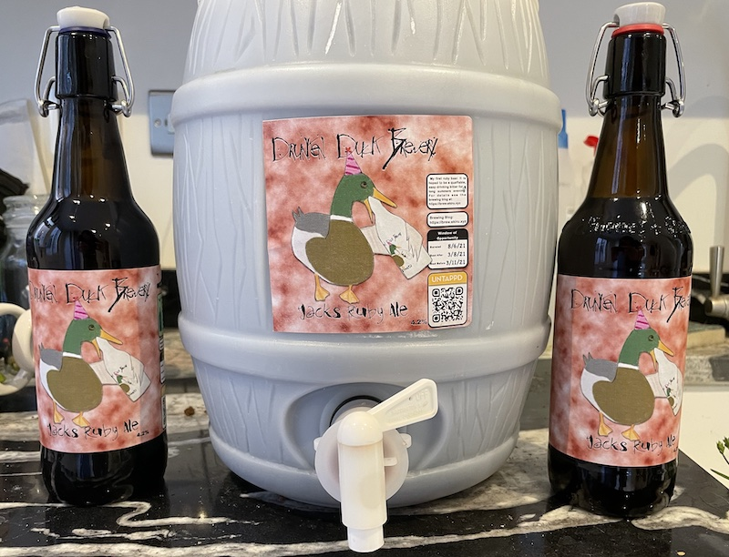

Time to make an ale, borrowing a [Hobgoblin recipe]( https://www.themaltmiller.co.uk/product/hobgoblin-ruby-red-ale-clone/).

## Ingredients

* BestMalt pale ale malt, 2150g
* Crisp crystal 240 (dark) malt, 180g
* Crisp chocolate malt, 50g
* East Kent goldings hop pellets, 7g
* Fuggles hop pellets, 7g
* Styrian Goldings hop pellets, 32g
* Cascade hop pellets, 8g
* WLP023 Burton ale yeast

## Brew Day, 30/5/21

1. Bring yeast up to 21C
2. Clean mash, spoon and chiller with PBW then rinse
3. Add false bottom
4. Add 14L water, grain pipe, 1 crushed campden tablet and raise to 67C with both heaters, then just the 550W to maintain temp
5. Add grain 500g at a time, stirring to make sure all is wet.
6. Swap grain blocker for top plate, overflow inlet and lid
7. Turn on pump for 60 minutes, maintaining 67C
8. While waiting:
   * Clean boiler with VWP
   * Put sparging water on to boil 10 minutes before end of mash in. heat 4l to 75C
9. Use 1900W heater to raise to 75C, keep there for 10 minutes
10. Raise malt pipe, slowly rinse with 4l sparge water. Sparge evenly
11. Raise to 98C with both elements while the grain drips dry
12. Remove grain pipe, add lid, boil for 60 minutes. Use 1900W element
13. Add goldings and Fuggles at 60 minutes (eg start)
14. While waiting:
    * Clean grain pipe
    * Clean fermenter with VWP and rinse
    * Chemsan chiller and fermenter
15. add cascade and styrian golding 15 minutes from end
16. Add 5g moss 5 minutes before end
17. Add pump pipe 5m from end to sanitise
18. Stir in foam and whirlpool with pump
19. Add chiller and pump beer over chiller, drop to 20C (using thermometer)
20. Pump wort into fermenter while aerating
21. Measure OG, expect 1.046, actual OG 1.039
22. Add yeast according to packet
23. Ferment at 18C for ~10 days, expect FG of 1.012

## Graph

* The expected OG was 1.046 and SG 1.012. As the graph shows I actually got OG 1.039 and SG 1.009
* The room has digital heating control which was set to stop the temperate dropping below 20C. Unfortuantely due to the (fortunate) unexpected arrival of summer the heating wasn't an issue, and the room slowly crept up to 23C.

## Barreling day, 9/6/21

1. Clean barrel and piping with VWP
2. Carefully siphon beer into barrel, minimising splashing.
3. 11l useable from 12l in fermenter
4. Add 2.5g/l priming sugar = 30g.
5. vaseline seal
6. store in ~20C for 1 week
7. store in ~12C for 7 weeks.

   

## Lessons learned 

- Don’t forget to add false bottom before the malt pipe. It seemed to survive but probably not a good idea.
- Put sparging water on to heat in plenty of time so is ready for sparging as soon as the malt is.
- Get some [lipohop](https://www.themaltmiller.co.uk/product/nbs-lipohop-k-15g/) to stop foaming during boil. 
- 14l + 4 sparge = 12l at fermentation start, sufficient for 24 bottles.
- 11l beer doesn't fit into a 10l fermenter! Calculate recipes accoridngly, 10l for barreling, 12l for bottling. Or just brew 12l and add the spare to 2 bottles.
- I've added a best after date to the labels to reflect the time needed for the beer to develop flavours post-fermentation.

## Tasting Notes

* Only tasted during siphoning, tasted like a bitter. Leave it 8 weeks to mature.
* Beer has been added to [untappd](https://untappd.com/b/drunken-duck-brewery-jacks-ruby-ale/4351958).
* Tasting notes will be added here, but also (hopefully) through the untappd link above.